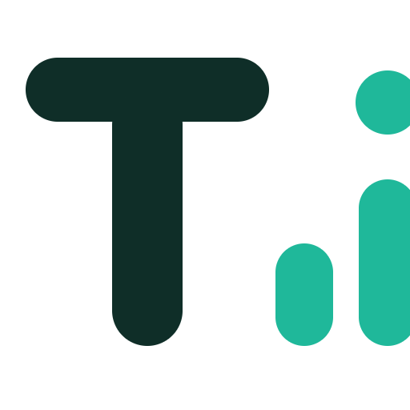

# Edward Nguyen - Data Analytics Portfolio 🚀

Welcome to my personal portfolio repository! This is a modern, fast, and responsive portfolio website built with **React**, **Vite**, **Tailwind CSS**, and **Framer Motion**. It is designed to showcase data analytics projects, financial modeling experience, and technical skills in a clean, hacker-style interface.

 <!-- Update with actual screenshot later if you have one -->

🌐 **Live Demo:** [https://personal-portfolio-smoky-sigma-24.vercel.app](https://personal-portfolio-smoky-sigma-24.vercel.app)

---

## 🎯 Features

- 🌓 **Dark/Light Mode Toggle**: Integrated theme switching out of the box.
- ⚡ **Lightning Fast**: Built with Vite for rapid development and optimized production builds.
- 🎨 **Beautiful Animations**: Smooth page transitions, hover effects, and scrolling animations using Framer Motion.
- 📊 **Dynamic Projects Slicer**: A sleek GitHub-style grid that automatically categorizes and filters projects (e.g., Data Analytics, Econometrics, Financial Analysis).
- 📱 **Responsive Design**: Looks great on desktop, tablet, and mobile.
- ⚙️ **Data-Driven Content**: Projects and certifications are loaded directly from simple JSON files, making it extremely easy to update without touching the React code.

---

## 🛠️ Tech Stack

- **Framework**: [React](https://reactjs.org/) + [Vite](https://vitejs.dev/)
- **Styling**: [Tailwind CSS](https://tailwindcss.com/) + Vanilla CSS
- **Animations**: [Framer Motion](https://www.framer.com/motion/)
- **Icons**: [Lucide React](https://lucide.dev/)
- **Deployment**: [Vercel](https://vercel.com/)

---

## 🚀 Getting Started

If you want to clone this repository to view the code, run it locally, or use it as inspiration for your own portfolio, follow these steps:

### Prerequisites
Make sure you have [Node.js](https://nodejs.org/) installed on your machine (version 18+ is recommended).

### Installation

1. **Clone the repository**
   ```bash
   git clone https://github.com/trinpb04/personal-portfolio.git
   cd personal-portfolio
   ```

2. **Install dependencies**
   ```bash
   npm install
   ```

3. **Start the development server**
   ```bash
   npm run dev
   ```

4. **View in browser**
   Open [http://localhost:5173](http://localhost:5173) in your browser to see the app running locally.

---

## 📂 Project Structure & Customization

If you want to customize this portfolio, everything is neatly organized:

- `src/data/projects.json`: Add or modify your projects here. The UI will automatically generate the filtering buttons (Slicer) based on the `category` fields you provide.
- `src/data/certifications.json`: Update your certificates and courses here.
- `src/components/Techstack.jsx`: Edit your core skills and proficiency levels.
- `src/components/AboutMe.jsx`: Update your personal introduction, location, and social links.
- `public/`: Replace `favicon.png` with your own logo.

---

## 🌍 Deployment

This project is optimized for deployment on Vercel. 

**Quick Deploy via Vercel CLI:**
```bash
npx vercel
```

**Or deploy via GitHub:**
Simply push this repository to your GitHub account, connect it to [Vercel](https://vercel.com/), and it will deploy automatically on every push.

---

## 📝 License

This project is open-source and available under the [MIT License](LICENSE). Feel free to fork, clone, and modify it for your own personal use!
